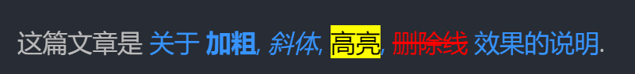

# MarkOwl Language | 一种新的轻量级文本标记语言

> English document is under construction.

## 设计目标

- 语法优雅
- 标记简洁 & 易于书写
- 语法健全. 不能出现自相矛盾, 漏洞百出, 解释不清的地方
- 标记含义明确, 不要有歧义
- 标记不可以对正文文字造成视觉干扰 (不能让阅读者看着眼花缭乱, 分不清主次, 感到不适或困惑等)
- 标记规则的设计有完整的内在逻辑. 不能让各种标记百花齐放, 毫无规律可循
- 标记是宽容的. 错误的标记不会造成文本渲染的灾难
- 可扩展, 可编程. 最好支持脚本语言 (python/javascript) 的控制
- 可配置: 全局配置, 项目配置, 单文件配置 (front matter), 局部配置 (block scope)
- 支持项目级文档输出 ("导出成册")
- 持续更新, 标记规则将纳入版本控制, 与时俱进

## *TODO: 快速上手*

~~如果您非常熟悉 markdown. 建议阅读这篇文章: [一对一的语法比较]([[markup]-markdown-markowl-一对一比较.md]), 来快速学习新的文本标记语言.~~

## 核心规则

### 标记的边界必须是明确的

"标记的边界" 指标记的开始处和结尾处, 它们需要明确的符号来指明. 

例如, 使用括号包裹的文本, 左括号和右括号是它的边界; 使用引号包裹的文本, 前引号和后引号是它的边界.

在 markowl 中, **我们使用且唯一使用的边界符号是成对的方括号 (`[]`)**. 

即, 任何一段要被标记的文本, 都必须以 `[` 开始, 最后以 `]` 结尾. 这段被包裹的部分才是有效标记文本.

### 允许嵌套标记

嵌套规则如下:

1. 默认情况下, 作用域是继承的; 即外层括号的效果会同时作用到内层括号:

    ```
    这是一个 [**加粗并[==高亮]] 的效果.
    ```

    注: 我们另有其他标记可以清除这种继承效果, 见后续的语法表.

2. 内层括号的优先级高于外层, 当效果产生冲突时, 以内层括号为准:

    ```
    这是 [#red;红色字体和[#green;绿色字体]].
    ```

综合示例:

```
这篇文章是 [关于 [**加粗], [*斜体], [==高亮], [~~[#red;删除线]] 效果的说明 <https://example.com/article.html>].
```

  

*另附 markdown 同样效果的写法:*

```md
这篇文章是 [关于 **加粗**, *斜体*, <span style="background-color: yellow; color: black">高亮</span>, ~~<font color="red">删除线</font>~~ 效果的说明](https://example.com/article.html).
```

### 标记的格式

标记分为 "标准语法" 和 "简写语法".

标准语法非常强调逻辑性和严整性. 简写语法则充分利用符号的特点, 在保证无歧义的情况下提高书写和阅读的流畅性.

常用的标准语法都提供了对应的简写语法. 其次 markowl 的编程特性允许用户自定义 (扩展或重写) 简写语法. (本节只介绍前者)

#### 标准语法格式

```
[正文内容 :指令(参数1, 参数2, 参数3, ...)]
[正文内容 :指令缩写]
```

快速演示:

```
这是一个 [加粗:bold()] 效果
这是一个 [加粗:b] 效果

[这是一级标题:heading(level=1, numberic=false)]
[这也是一级标题:h1]

这是本项目的 [链接 :link(https://github.com/likianta/markowl-lang)].

下面是一张图片:
[:image(https://example.com/image.png, width=600, height=400, align=center)]
```

详细说明:

1. `[正文内容 :指令(参数1, 参数2, 参数3, ...)]`

    格式细节:

    - 指令位于后括号附近.
    - 指令必须以冒号开头, 后跟一个指令名称 (名称由英文和下划线组成).
        - 冒号前面的空格 (或者称之为正文与指令之间的空隙) 是可选的. 在渲染时, 该空格会被忽略.
    - 指令的传参格式借鉴了 python 函数调用. 可以使用位置参数和关键字参数, 支持缺省参数. 
        - 但也有不同的地方: 
            - 对于字符串参数, 我们不会用引号包裹, 而是直接书写字面值.
            - 对大小写不敏感. 例如, 布尔值我们推荐使用 true 和 false, 而不是 True 和 False. 未定义值推荐用 none 而不用 None.
            - 从参数特征角度来讲, 我们在 markowl 的设计之初尽可能地使用简单的参数形式, 参数名称中不会包含空格, 结构体, 特殊符号等容易对标记结构造成破坏性影响的内容 (绝大多数情况, 只会用到单词, 连字符和下划线).
    - 当参数为空时, 允许省略掉指令后面的小括号.

    所有指令均会在后续的语法表中列出.

2. `正文内容 :指令缩写`

    > 注意: 不是所有指令都有对应的指令缩写. 只有常用的会提供.

    部分指令名称提供了常见的缩写形式, 例如 ":bold()" 和 ":b", ":image(url, ...)" 和 "img(url)".

    请注意缩写并非是简单地使用了单词的省略写法. 指令缩写的目的是 **把常用的带参指令更快地调用出来**, 因此写法上会兼顾简洁性和表达能力:

    示例: 

    ```
    [这是一条注释. 注释不会被渲染. :comment()]
    [这是一条注释. 注释不会被渲染. :cmt]

    [一级标题 :heading(level=1, numberic=false)]
    [一级标题 :h1]

    [二级标题 :heading(level=2)]
    [二级标题 :h2]

    [三级标题 (带有编号) :heading(level=3, numberic=true)]
    [三级标题 (带有编号) :h3x] [h3x 中的 'x' 取自单词 'index' :cmt]
    
    [这是一个有序列表项 :list(order=true)]
    [这是一个有序列表项 :ol]

    [这是一个无序列表项 :list(order=false)]
    [这是一个无序列表项 :ul]
    ```

    再次提醒: 只有常用的标准指令提供了指令缩写. 但用户可以通过编程/配置的方式添加自定义的指令缩写 (或者修改已有的指令缩写).

#### 简写语法格式

> 注意: 不是所有指令都有对应的简写格式. 只有常用的会提供.

```
[前置标记符;正文内容]
[前置标记符 正文内容]

[正文内容 后置标记符]
[正文内容;后置标记符]
```

格式说明:

- 前置标记符与正文内容之间使用空格或分号分隔. (空格或分号的作用是相同的, 都是为了与正文内容分开. 您可以根据样式观感来选择用哪个.)
- 后置标记符与正文内容之间使用空格或分号分隔. *但是分号目前仍处于实验阶段, 未经过充分测试; 建议只使用空格作为分隔.*
- 在同一标记块中, 前置标记符与后置标记符最多只有其中一方会出现.
- 无论是前置标记符还是后置标记符, (从设计角度) 都不允许使用空格作为标记符自身的一部分.

快速演示:

```
(前置标记符演示:)

这是 [加粗:b], [斜体:i], [高亮:highlight] 效果
这是 [**加粗], [*斜体], [==高亮] 效果

[这是一级标题:h1]
[# 这也是一级标题]

这是一个 [自定义颜色和背景色的高亮文字:color(fg=white, bg=red)]
这是一个 [#white/#red;自定义颜色和背景色的高亮文字]

[这是一段注释. 注释不会被渲染. :cmt]
[/ 这是一段注释. 注释不会被渲染.]

(后置标记符演示:)

这是本项目的 [链接 :link(https://github.com/likianta/markowl-lang)].
这是本项目的 [链接 <https://github.com/likianta/markowl-lang>]

下面是一张图片:
[图片占位文字 :image(https://example.com/image.png, width=600, height=400, align=center)]
[图片占位文字 !<https://example.com/image.png 600x400>] 

[/ 请注意, 有些简写语法无法像标准语法那样详细定义每个参数, 部分参数只能使用缺省值.]
```

简写语法与标准语法的重要区别有两点:

1. 使用符号而非指令名称 (英文单词) 来减少视觉干扰.
2. 符号的位置可以前置 (左括号附近), 也可以后置 (右括号附近). 而指令必须后置.
    
    问: 为什么有些符号选择了前置, 有些选择了后置?

    答: 它取决于在语法设计时, 对阅读的焦点和内容优先级的考虑. 具体要求为:

    1. 如果符号短促, 简洁, 则放在前置位置, 方便书写者一眼看到它的标记效果.
    2. 如果符号较长 (例如 url), 则放在后置位置, 确保书写者先看到主要文字 (正文), 然后是次要文字 (链接). (这也符合我们的书写习惯.)

    下面的示例会加深此理解:

    ```
    [这是一段非常长的文本, 我会对它标记为特定的格式. 直到你看到末尾, 你才知道我用了什么标记. :color(#427ecc)]

    [#427ecc 这是一段非常长的文本, 我会对它标记为特定的格式. 现在, 在你读到本段时, 你已经知道标记效果是什么了.]
    ```

#### 小结

通常地, 标准标记语法不可避免地会比 markdown 显得更加繁琐. **在日常书写中, 我们提倡使用简写语法.**

### 边界省略

1. 如果标记位于本行末尾, 则后方括号可省略
2. 如果标记位于本行开头, 则前方括号可省略 
3. 如果标记应用于整行, 则前后方括号均可省略

示例:

```
[# 这是标题]
# 这是标题

[> 这是一段引用.]
> 这是一段引用.

这是正文内容. [/ 这是注释]
这是正文内容. [/ 这是注释

- 这是一个列表项目
    [| 这是一个软换行]
    [| 这是一个软换行]
    [| 这是一个软换行]
- 这是一个列表项目
    | 这是一个软换行
    | 这是一个软换行
    | 这是一个软换行

/ 上面这个还有另一种写法:

- 这是一个列表项目
    [这是一个软换行 |]
    [这是一个软换行 |]
    [这是一个软换行 |]
- 这是一个列表项目
    这是一个软换行 |
    这是一个软换行 |
    这是一个软换行 |
```

### 在段落之间, 用空行表示换行

略.

### 禁止转义

有两种方式禁止转义:

- 使用反斜杠 (\\), 对反斜杠后面的一个字符产生作用
- 使用反引号 (\`), 对成对的反引号包裹的内容产生作用

示例:

```
显示原始样式的 \[链接 <https://example.com>\]
显示原始样式的 `[链接 <https://example.com>]`

查看这篇文档: c:/documents/[#blue; \[01\]\[2022-04-29\] introduction.pdf]
查看这篇文档: c:/documents/[#blue; `[01][2022-04-29]` introduction.pdf]
```

## 语法表

注:

1. 按字母表顺序排列.
2. 在示例中, 一般会展示标准语法和简写语法这两种写法.

### align | 对齐

- 指令: `:align(alignment=center)`
    - alignment: 对齐方式
        - 类型: `literal[center, left, right]`
            - center: 居中对齐
            - left: 左对齐
            - right: 右对齐
- 符号:
    - `-^-`: 居中对齐
    - `-<-`: 左对齐
    - `->-`: 右对齐
- 符号位置:
    - 前置
- 示例:

    ```
    [这是一段居中的文本 :align(center)]
    -^- 这是一段居中的文本

    [段落右对齐 :align(rihgt)]
    ->- 段落右对齐
    ```

    综合运用:

    ```
    / 给一张照片添加标题.

    [风景 !<http://example.com/image.png 1200x600>]

    -^- 由 [xxx <...>] 拍摄并上传.
    ```

    ````
    / 给代码添加来源.

    ``` :lang(python)
    import sys
    print(sys.executable)
    ```
    
    ->- [*代码片段来自 [<https://example.com/code-snip.html>]].
    ````

### bold | 加粗

- 指令: `:bold()`
- 缩写: `:b`
- 符号: `**`
- 符号位置:
    - 前置
- 示例:

    ```
    这是 [**加粗] 效果.
    ```

### cite | 引用

- 指令: `:cite()`
- 符号: `>`
- 符号位置:
    - 前置
- 示例:

    ```
    [这是一段引用. :cite]
    [> 这是一段引用.]
    > 这是一段引用.
    ```

### clear | 清除标记效果

- 指令: `:clear()`
- 说明: 

    当使用嵌套标记时, 默认的行为内层标记会继承于外层; 使用本标记可清除这种继承效果.

- 示例:

    ```
    这是 [**加粗并 [==高亮]] 的效果.
    这是 [**加粗 [或者:clear] [[==高亮]:clear]] 的效果.

    [/ ps: 它相当于... ]
    
    这是 [**加粗] 或者 [==高亮] 的效果.
    ```

### codeblock | 代码块

- 符号:

    ````
    ``` language_or_command
    ```
    ````

    - language_or_command: `union[language, command]`
        - language: `str[cpp, csharp, javascript, js, py, python, ...]`
        - command: `:bold`, `:italic`, `:comment`, ...

- 示例:

    ````
    ``` py
    print('hello world')
    ```

    ``` :lang(py)
    print('hello world')
    ```

    ``` :comment
    整个文本块都是注释, 不会被渲染.
    整个文本块都是注释, 不会被渲染.
    整个文本块都是注释, 不会被渲染.
    ```

    ``` :bold :color(red)
    整个文本块以红色加粗字体显示.
    整个文本块以红色加粗字体显示.
    整个文本块以红色加粗字体显示.
    ```

    ...

    ````

### color | 字体颜色

- 指令: `:color(fg_color, bg_color=none)`
    - fg_color: 前景色
        - 类型: `union[hex, name, none]`
            - hex: 不区分大小写. 例如 '#00ff00'
            - name: 标准色名称 (*TODO:提供完整的参考表*). 例如 'red', 'cyan'
            - none: 不定义. 使用系统默认值
    - bg_color: 背景色
        - 类型: `union[hex, name, none]`
        - 默认值: `none`
- 符号: 
    - `#fg_color/#bg_color`: 指定前景色和背景色
    - `#fg_color`: 只指定前景色 (字体颜色)
    - `#none/#bg_color`: 只指定背景色
- 符号位置:
    - 前置
- 示例:

    ```
    这是 [绿色字体 :color(green)].
    这是 [红底白字 :color(white, red)] 效果.
    这是 [自定义颜色的字体 :color(#2839ff)].
    这是 [字体颜色默认, 只定义了背景色 :color(none, yellow)] 的情况.

    这是 [#green 绿色字体].
    这是 [#white/#red 红底白字] 效果.
    这是 [#2839ff 自定义颜色的字体].
    这是 [#none/#yellow 字体颜色默认, 只定义了背景色] 的情况.
    ```

### comment | 注释

- 指令: `:comment()`
- 缩写: `:cmt`
- 符号: `/`
- 符号位置:
    - 前置
- 说明: 一般用于行尾或整行. 行内可以用, 但非常少见.
- 示例:

    ```
    这是正文内容. [/ 这是注释]
    / 这一整行都是注释.
    ```

    当用于块注释时, 这样做:

    ````
    ``` :cmt
    这是块注释
    这是块注释
    这是块注释
    ```
    
    ``` /
    这是块注释
    这是块注释
    这是块注释
    ```
    ````

### heading | 标题

- 指令: `:heading(level=1, numberic=false)`
- 缩写: 
    - `:h`: 表示一级标题
    - `:h1`: 一级标题
    - `:h1x`: x 取自 'index' 这个词. 表示带有编号的章节标题
- 符号:
    - `#`: 一级标题
    - `#.`: 带有编号的一级标题
- 符号位置:
    - 前置
- 说明:

    二级标题, 三级标题按照上面的格式类推. 即 `:h2`, `:h3`, ... 或者 `##`, `###`, ...

- 示例:

    标题 (无序号):

    ```
    [heading 1 :heading(1)]
    [heading 2 :heading(2)]
    [heading 3 :heading(3)]

    [heading 1 :h1]
    [heading 2 :h2]
    [heading 3 :h3]
    
    # heading 1
    ## heading 2
    ### heading 3
    ```

    标题 (有序号):

    ```
    [heading 1 :heading(1, true)]
    [heading 2 :heading(2, true)]
    [heading 3 :heading(3, true)]

    [heading 1 :h1x]
    [heading 2 :h2x]
    [heading 3 :h3x]

    #. heading 1
    ##. heading 2
    ###. heading 3
    ```

### highlight | 高亮

- 指令: `:highlight(fg_color=black, bg_color=yellow)`
- 符号: `==`
- 符号位置:
    - 前置
- 示例:

    ```
    这是 [高亮 :highlight] 效果.
    这是 [自定义颜色的高亮 :highlight(white, red)] 效果.

    这是 [==高亮] 效果.
    [/ 注: 简写语法相较于标准语法, 在参数定义方面受限. 我们可以换一种方法达到自定义颜色的高亮效果. 如下: ]
    这是 [#white/#red[==自定义颜色的高亮]] 效果.
    ```

### image | 图片

- 指令: `:image(url, width=none, height=none, align=center, fill=fit_width, **kwargs)`
    - url: 网络链接或本地路径 (绝对或相对位置).
    - width: 自定义图片的宽度. 单位像素.
        - 类型: `optional[int]`
    - height: 自定义图片的高度. 单位像素.
        - 类型: `optional[int]`
    - align: 对齐方式. 仅在图片在单独一行呈现时生效.
        - 类型: `literal[center, left, right]`
            - center: 居中对齐
            - left: 左对齐
            - right: 右对齐
    - fill: 填充模式
        - 类型: `literal[fit_width, fit_height, stretch, pad]`
            - fit_width: 匹配视图宽度或自定义的 width 参数. 按比例计算高度. (此时自定义的 height 参数会失效.)
            - fit_height: 匹配视图高度或自定义的 height 参数. 按比例计算宽度. (此时自定义的 width 参数会失效.)
            - stretch: 拉伸. 当只定义了 width 或 height 其中一个时, 则按照原图宽高比例拉伸至目标值.
            - pad: 保持原图尺寸. (此时自定义的 width 和 height 参数会失效.)
        - 默认: fit_width
    - kwargs:
        - alt_text: 可选文字. 在鼠标移动到图片上时悬浮显示的文字信息.
        - caption: 在图片下方显示的图像标签信息 (居中).
- 缩写: `:img(url size 'alt_text')`
    - 注意: 缩写的传参格式并非按照标准指令设计. 可以有自己的写法和形式.
    - 参数:
        - url: 网络链接或本地路径 (绝对或相对位置).
        - size: 可选. 以宽乘高来表示. 例如 `800x600`, `1920x1080`.
        - 'alt_text': 可选, 在鼠标移动到图片上时悬浮显示的文字信息. 必须以引号包裹 (单双引号均可).
- 符号: `!<url>`
    - url: 网络链接或本地路径 (绝对或相对位置).
- 符号位置:
    - 前置
    - 后置
- 示例:

    ```
    [风景 :image(https://example.com/image.png, width=1920, height=1080)]

    [风景 :img(https://example.com/image.png 1920x1080 '喜马拉雅山')]

    [风景 !<https://example.com/image.png>]
    ```

### interpolation | 插值

- 指令: `:interpolation(插值1, 插值2, 插值3, ...)`
- 符号: 
    - `$`: 创建插值模板
    - `$number`: 向模板插值
        - number: 编号. 如果在插值模板中没有显式定义, 则按照每个值的渲染顺序自动创建编号.
- 符号位置:
    - 前置
- 说明:

    插值标记是用于解决下面的情景:

    当单行的标记过多时, 会导致阅读充满了 "杂讯" 干扰:

    ```
    这篇文章是 [关于 [**加粗], [*斜体], [==高亮], [~~删除线] 效果的说明 <https://example.com/article.html>].
    ```

    我们可以先对标记点收集起来, 然后逐个细化定义:

    ```
    这篇文章是 [$ [关于 [加粗], [斜体], [高亮], [删除线] 效果的说明]]
        [$1 :bold]
        [$2 :italic]
        [$3 :highlight]
        [$4 :strike]
        [$5 :link(https://example.com/article.html)]
    ```

    其中, 第一行 `[$ ...]` 是模板, 在模板下一行开始, 每行添加一个缩进, 并通过 `[$1 ...]`, `[$2 ...]` 逐个处理模板插值.

    上述示例中, 模板没有显式定义编号, 因此 `$1`, `$2`, ... 是根据渲染顺序自动产生的.

    您也可以显式创建编号. 编号语法如下:

    可以前置:

    ```
    这篇文章是 [$ [1:关于 [2:加粗], [3:斜体], [4:高亮], [5:删除线] 效果的说明]]
        [$1 :link(https://example.com/article.html)]
        [$2 :bold]
        [$3 :italic]
        [$4 :highlight]
        [$5 :strike]
    ```

    或者后置:

    ```
    这篇文章是 [$ [关于 [加粗:1], [斜体:2], [高亮:3], [删除线:4] 效果的说明:5]]
        [$1 :bold]
        [$2 :italic]
        [$3 :highlight]
        [$4 :strike]
        [$5 :link(https://example.com/article.html)]
    ```

### italic | 斜体

- 指令: `:italic()`
- 缩写: `:i`
- 符号: `*`
- 符号位置:
    - 前置
- 示例:

    ```
    这是 [*斜体] 效果.
    ```

### lang | 语言

- 指令: `:lang(language, **kwargs)`
    - language: str

        可以使用语言的全称或缩写. 例如 "python" 和 "py", "javascript" 和 "js".

        不区分大小写.
    
    - kwargs:
        - show_indent_line: `bool[default true]`

            是否显示缩进线. (仅对代码块结构有效)
        
        - show_line_number: `union[bool, literal['auto']]`

            是否显示代码的行号. 默认值是 'auto', 由语言和当前的环境配置决定. (仅对代码块结构有效)

- 符号: `$language`
    - language: str

        可以使用语言的全称或缩写. 例如 "python" 和 "py", "javascript" 和 "js".

        不区分大小写.

- 符号位置:
    - ~~前置~~
    - 后置
- 示例:

    ```
    这是一段 python 代码 [`print([1, 2, 3])` :lang(py)], 被标记的地方会被渲染为等宽字体并施加代码高亮. (取决于 ide 是否支持)
    这是一段 python 代码 [`print([1, 2, 3])` $py], 被标记的地方会被渲染为等宽字体并施加代码高亮. (取决于 ide 是否支持)
    ```

    此外, 当用于代码块 (codeblock) 时, 可以按下面的形式简写:

    ````
    ``` :lang(py)
    print('hello world')
    ```

    ``` py
    print('hello world')
    ```
    ````

### list | 列表

- 指令: `:list(order=false, start=1)`
    - order: bool
    - start: int

        该参数仅在 order 为 true, 且位于同级的第一个列表项时生效.

        将它设定为大于 1 的数, 则意味着强行从该序号开始编号.
- 缩写:
    - `:ol`: 有序列表
    - `:ul`: 无序列表
- 符号:
    - `<number>. `: 有序列表
        - number: 
            
            列表编号, 数字. 
            
            手动地, 递增地填写此编号. 
            
            考虑到列表在编辑时的变动较为频繁, 允许重复数字, 错乱编号等. 由格式化工具或者渲染程序自动校正.

    - `= `: 有序列表的另一种写法. 以等号 (=) 开头.
    - `- `: 无序列表. 以减号 (-) 开头.
- 符号位置:
    - 前置
- 示例:

    有序列表:

    ```
    [monday :list(order=true)]
    [tuesday :list(order=true)]
    [wednesday :list(order=true)]
    
    [monday :ol]
    [tuesday :ol]
    [wednesday :ol]

    1. monday
    2. tuesday
    3. wednesday
    
    = monday
    = tuesday
    = wednesday
    ```

    无序列表:

    ```
    [concise :list()]
    [intuitive :list()]
    [straightforward :list()]
    
    [concise :ul]
    [intuitive :ul]
    [straightforward :ul]

    - concise
    - intuitive
    - straightforward
    ```

### softwrap | 软换行

- 指令: `:softwrap()`
- 符号: `|`
- 符号位置:
    - 前置
    - 后置
- 说明:

    注: 该符号可单用也可以与内容一同包裹. 作为符号使用时, 可用于前置, 也可用于后置.

    用于前置:

    ```
    monday
    [| tuesday]
    [| wednesday]

    here another paragraph...
    ```

    用于后置:

    ```
    / 既可以单用:

    monday  [|]
    tuesday [|]
    wednesday

    / 也可以与内容一同包裹:
    
    [monday   |]
    [tuesday  |]
    wednesday

    here another paragraph...
    ```

    如果某行使用了软换行, 但它的上/下一行是空行, 则该软换行会被忽略. 所以下面的写法与上面的示例效果相同 (看起来会更美观):

    ```
    / 符号前置: 

    [| monday]    [/ 注意观察开头的不同之处]
    [| tuesday]
    [| wednesday]

    / 符号后置 -- 既可以单用:

    monday    [|]
    tuesday   [|]
    wednesday [|] [/ 注意观察结尾的不同之处]

    / -- 也可以与内容一同包裹:
    
    [monday    |]
    [tuesday   |]
    [wednesday |] [/ 注意观察结尾的不同之处]
    ```

    此外, 根据 "边界省略规则", 整行使用时, 左右方括号可以省略, 所以就成了下面的写法, 这也是我们最常用的写法:

    ```
    - 这是一个列表项
        | 对列表项的内容软换行显示
        | 对列表项的内容软换行显示
        | 对列表项的内容软换行显示
    
    这是第一段 |
    这是该段的软换行内容 |
    这是该段的软换行内容 |
    这是该段的软换行内容 |
    ```

### splitter | 分割线

- 指令: `:splitter(pattern=---, fg_color=none, bg_color=none, orientation=horizontal)`
- 符号: `---`

    长度大于等于 3.

    只能用于整行.

- 符号位置:
    - 前置
- 示例:

    ```
    这是一个段落...

    --- 
    
    这是另一个段落...
    ```
